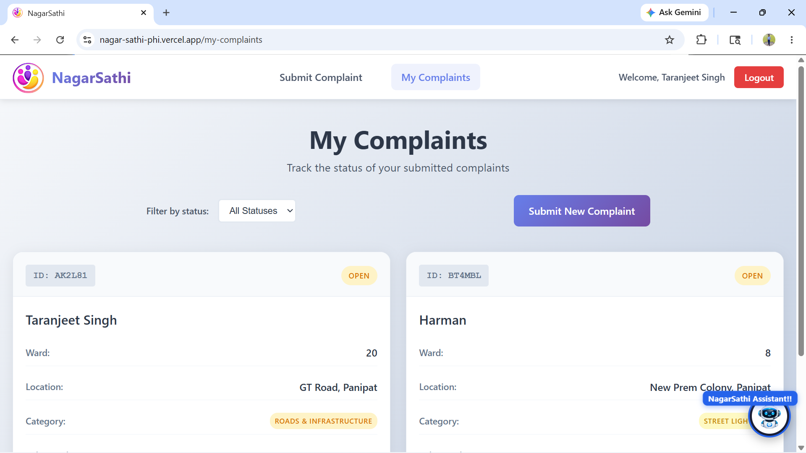

# 🏛️ NagarSathi – AI-Powered Grievance Management Platform

<div align="center">


[](https://nagar-sathi-phi.vercel.app/)
[](https://github.com/taranjeet-singh0484/NagarSathi)
[](LICENSE)

**A full-stack AI-powered civic complaint management platform enabling citizens to report, track, and resolve community issues with intelligent automation.**

[Live Demo](https://nagar-sathi-phi.vercel.app/) · [Report Bug](https://github.com/taranjeet-singh0484/NagarSathi/issues) · [Request Feature](https://github.com/taranjeet-singh0484/NagarSathi/issues)

</div>

---

## 📋 Table of Contents

- [Overview](#-overview)
- [Features](#-features)
- [Tech Stack](#-tech-stack)
- [AI Features](#-ai-features)
- [Screenshots](#-screenshots)
- [Getting Started](#-getting-started)
- [Environment Variables](#-environment-variables)
- [API Routes](#-api-routes)
- [Authentication](#-authentication)
- [Project Structure](#-project-structure)
- [Deployment](#-deployment)

---

## 🌟 Overview

NagarSathi is a production-grade MERN stack platform designed for Indian citizens to submit civic complaints, track resolution progress, and engage with AI-powered tools. The platform features role-based access for Citizens and Admins, Google OAuth 2.0 authentication, and 4 integrated AI modules powered by Groq LLM API.

---

## ✨ Features

### 👤 Citizen Panel
- ✅ Register via **Google OAuth 2.0** (secure, no fake accounts)
- ✅ Optional password setup post-registration for email login
- ✅ Submit complaints with **photo evidence** (Cloudinary)
- ✅ AI **auto-detects complaint category** across 13 categories
- ✅ **Duplicate complaint detection** before submission
- ✅ Track complaint status in real-time (Open / In Progress / Resolved)
- ✅ **AI Chatbot** with personalized complaint context
- ✅ Request Admin role upgrade (pending approval flow)

### 🛡️ Admin Panel
- ✅ View **all complaints sorted by AI urgency** (Critical → High → Medium → Low)
- ✅ Filter complaints by status, category, ward, and search
- ✅ Update complaint status with resolution notes
- ✅ **Pending admin request approval** system
- ✅ Dashboard stats: Total, Open, In Progress, Resolved, Critical, High Urgency
- ✅ AI-generated urgency badges and reasons per complaint

### 🤖 AI Features (Groq LLM API)
- ✅ **Category Detection** — auto-classifies complaints into 13 categories
- ✅ **Sentiment & Urgency Analysis** — scores complaints as critical/high/medium/low
- ✅ **Duplicate Detection** — hybrid string similarity + Groq cross-language check
- ✅ **NLP Chatbot** — personalized assistant with real-time complaint context

---

## 🛠️ Tech Stack

| Layer | Technology |
|-------|-----------|
| **Frontend** | React.js, Vite, CSS3, Tailwind CSS |
| **Backend** | Node.js, Express.js |
| **Database** | MongoDB, Mongoose |
| **Authentication** | Google OAuth 2.0, Passport.js, JWT |
| **AI & LLM** | Groq LLM API (llama-3.1-8b-instant) |
| **File Storage** | Cloudinary |
| **Deployment** | Vercel (Frontend), Render (Backend) |

---

## 🤖 AI Features

### 1. Category Detection
Automatically classifies complaint descriptions into one of 13 categories using Groq LLM API on form blur event.

**Categories:** Roads & Infrastructure, Water Supply, Sanitation & Waste, Street Lighting, Public Safety, Environmental Issues, Noise Pollution, Drainage & Sewage, Traffic & Parking, Illegal Construction, Stray Animals, Parks & Public Spaces, Government Staff Misconduct

### 2. Sentiment & Urgency Analysis
Analyzes complaint text to determine:
- **Sentiment:** Positive / Negative / Neutral
- **Urgency:** Critical / High / Medium / Low
- **Urgency Reason:** One-line explanation

### 3. Duplicate Detection (Hybrid)
Two-step approach:
1. **String Similarity** (fast, offline) — checks text similarity score
2. **Groq LLM** (if score ≥ 0.5) — cross-language location-aware verification

Supports English, Hindi, Punjabi, and Hinglish.

### 4. NLP Chatbot
Personalized citizen assistant that:
- Fetches user's actual complaints from DB for context
- Answers status queries, guides complaint submission
- Supports English, Hindi, and Punjabi
- Maintains conversation history (last 6 messages)

---

## 📸 Screenshots

### Citizen Dashboard


### Admin Dashboard  


### Admin Home  


### AI Chatbot


## 🚀 Getting Started

### Prerequisites
- Node.js v18+
- MongoDB Atlas account
- Google Cloud Console project
- Groq API key
- Cloudinary account

### Installation

**1. Clone the repository**
```bash
git clone https://github.com/taranjeet-singh0484/NagarSathi.git
cd NagarSathi
```

**2. Install backend dependencies**
```bash
cd backend
npm install
```

**3. Install frontend dependencies**
```bash
cd frontend
npm install
```

**4. Set up environment variables** (see [Environment Variables](#-environment-variables))

**5. Run development servers**
```bash
# Backend (from root)
npm run dev

# Frontend (from frontend folder)
cd frontend && npm run dev
```

---

## 🔐 Environment Variables

### Backend (`backend/.env`)
```env
# Server
PORT=5000
NODE_ENV=development

# Database
MONGODB_URI=your_mongodb_connection_string

# JWT
JWT_SECRET=your_jwt_secret_key
JWT_EXPIRES=7d

# Google OAuth
GOOGLE_CLIENT_ID=your_google_client_id
GOOGLE_CLIENT_SECRET=your_google_client_secret
GOOGLE_CALLBACK_URL=http://localhost:5000/api/auth/google/callback

# Frontend URL
FRONTEND_URL=http://localhost:5173

# Cloudinary
CLOUDINARY_CLOUD_NAME=your_cloud_name
CLOUDINARY_API_KEY=your_api_key
CLOUDINARY_API_SECRET=your_api_secret

# Groq AI
GROQ_API_KEY=your_groq_api_key
```

### Frontend (`frontend/.env`)
```env
VITE_API_URL=http://localhost:5000/api
VITE_BACKEND_ORIGIN=http://localhost:5000
```

---

## 📡 API Routes

### Auth Routes `/api/auth`
| Method | Endpoint | Access | Description |
|--------|----------|--------|-------------|
| `POST` | `/register` | Public | Register with email/password |
| `POST` | `/login` | Public | Login with email/password |
| `GET` | `/me` | Protected | Get current user |
| `GET` | `/google` | Public | Initiate Google OAuth |
| `GET` | `/google/callback` | Public | Google OAuth callback |
| `POST` | `/set-password` | Protected | Set password post-OAuth |

### Complaint Routes `/api/complaints`
| Method | Endpoint | Access | Description |
|--------|----------|--------|-------------|
| `POST` | `/` | Citizen | Submit new complaint |
| `GET` | `/` | Protected | Get complaints (role-filtered) |
| `PATCH` | `/:id/status` | Admin | Update complaint status |

### AI Routes `/api/ai`
| Method | Endpoint | Access | Description |
|--------|----------|--------|-------------|
| `POST` | `/detect-category` | Protected | Auto-detect complaint category |

### Chat Routes `/api/chat`
| Method | Endpoint | Access | Description |
|--------|----------|--------|-------------|
| `POST` | `/` | Citizen | Chat with AI assistant |

### Admin Request Routes `/api/admin-requests`
| Method | Endpoint | Access | Description |
|--------|----------|--------|-------------|
| `POST` | `/request` | Citizen | Request admin role |
| `GET` | `/pending` | Admin | Get pending admin requests |
| `PATCH` | `/:id/approve` | Admin | Approve admin request |
| `PATCH` | `/:id/reject` | Admin | Reject admin request |

---

## 🔒 Authentication

NagarSathi uses a dual authentication system:

### Google OAuth 2.0 (Primary)
```
Register → Google OAuth popup → Account created (role: citizen)
        → Optional password setup modal
        → Redirect to /my-complaints
```

### Email/Password (Login only)
```
Login → Email + Password → JWT token → Role-based redirect
```

### JWT Token Structure
```json
{
  "id": "user_id",
  "role": "citizen | admin",
  "email": "user@gmail.com",
  "adminStatus": "none | pending | approved | rejected"
}
```

### Role-Based Access Control
| Role | Access |
|------|--------|
| **Guest** | Home, Login, Register |
| **Citizen** | Submit Complaint, My Complaints, Chatbot, Request Admin |
| **Admin** | Admin Dashboard, Manage Complaints, Approve Admin Requests |

### Admin Approval Flow
```
Citizen requests admin role
        ↓
adminStatus: "pending"
        ↓
Existing admin reviews request in dashboard
        ↓
Approved → role: "admin", adminStatus: "approved"
Rejected → role: "citizen", adminStatus: "rejected"
```

---

## 📁 Project Structure

```
NagarSathi/
├── backend/
│   ├── src/
│   │   ├── ai/
│   │   │   ├── categoryDetection.js
│   │   │   ├── sentimentAnalysis.js
│   │   │   └──duplicateDetection.js
│   │   │    
│   │   ├── config/
│   │   │   ├── db.js
│   │   │   ├── env.js
│   │   │   └── passport.js
│   │   ├── controllers/
│   │   │   ├── authController.js
│   │   │   ├── complaintController.js
│   │   │   ├── chatController.js
│   │   │   └── adminRequestController.js
│   │   ├── middleware/
│   │   │   ├── auth.js
│   │   │   └── errorHandler.js
│   │   ├── models/
│   │   │   ├── User.js
│   │   │   ├── adminRequest.js
│   │   │   └── Complaint.js
│   │   ├── routes/
│   │   │   ├── authRoutes.js
│   │   │   ├── complaintRoutes.js
│   │   │   ├── aiRoutes.js
│   │   │   ├── chatRoutes.js
│   │   │   └── adminRequestRoutes.js
│   │   ├──  utils/
│   │   │   ├── cludinary.js
│   │   │   ├── emailValidator.js
│   │   │   └── formatDate.js
│   │   └── server.js
│   └── .env
├── frontend/
│   ├── src/
│   │   ├── components/
│   │   │   ├── Navbar.css
│   │   │   ├── Navbar.jsx
│   │   │   ├── ComplaintForm.css
│   │   │   ├── ComplaintForm.jsx
│   │   │   ├── MyComplaints.css
│   │   │   ├── MyComplaints.jsx
│   │   │   ├── AdminDashboard.css
│   │   │   ├── AdminDashboard.jsx
│   │   │   ├── AdminRequestingPannel.css
│   │   │   ├── AdminRequestinPannel.jsx
│   │   │   ├── ChatWidget.css
│   │   │   ├── ChatWidget.jsx
│   │   │   └── CititzenRequestingAdminRole.css
│   │   │   └── CititzenRequestingAdminRole.jsx
│   │   ├── pages/
│   │   │   ├── Home.css
│   │   │   ├── Home.jsx
│   │   │   ├── Login.css
│   │   │   ├── Login.jsx
│   │   │   └── Register.css
│   │   │   └── Register.jsx
│   │   ├── services/
│   │   │   └── api.js
│   │   └── App.jsx
│   └── .env
└── README.md
```

---

## 🌐 Deployment

### Frontend — Vercel
```
Build Command: npm run build
Output Directory: dist
Environment Variables: VITE_API_URL, VITE_BACKEND_ORIGIN
```

### Backend — Render
```
Start Command: node backend/src/server.js
Environment Variables: All backend .env variables
```

### Production URLs
| Service | URL |
|---------|-----|
| **Frontend** | https://nagar-sathi-phi.vercel.app |
| **Backend** | https://nagarsathi-0xuy.onrender.com |

> **Note:** Backend is on Render free tier — first request after inactivity may take 30-50 seconds (cold start).

---

## 👨‍💻 Author

**Taranjeet Singh**

[](https://github.com/taranjeet-singh0484)

---

## 📄 License

This project is licensed under the MIT License.

---

<div align="center">
  Made with ❤️ for the community
  <br/>
  <a href="https://nagar-sathi-phi.vercel.app/">🚀 Live Demo</a> · 
  <a href="https://github.com/taranjeet-singh0484/NagarSathi">⭐ Star on GitHub</a>
</div>
```
